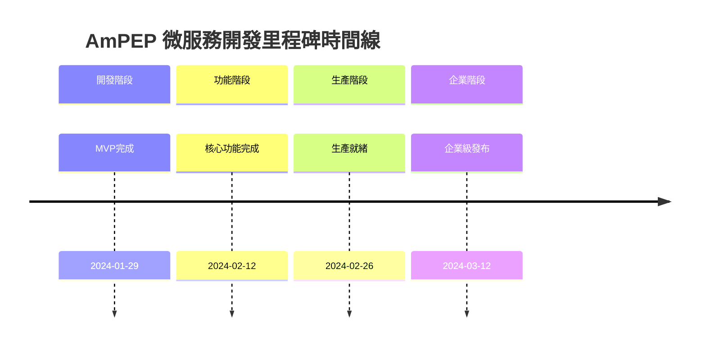

# AmPEP 微服務開發里程碑

## 🎯 里程碑概覽

## 🚀 里程碑 1: MVP完成 (2024-01-29)

### 🎯 目標
建立可工作的AmPEP微服務原型，驗證技術可行性。

### 📋 交付物清單

#### 核心功能
- [ ] **基礎API服務**
  - 健康檢查端點 (`GET /health`)
  - 預測端點 (`POST /api/predict`)
  - 基本錯誤處理

- [ ] **Docker容器化**
  - 可運行的Docker鏡像
  - 容器健康檢查
  - 端口映射配置

- [ ] **輸入驗證**
  - FASTA格式驗證
  - 氨基酸序列驗證
  - 錯誤響應標準化

#### 技術基礎
- [ ] **R環境配置**
  - R 4.0+ 運行環境
  - plumber包安裝
  - 依賴包管理

- [ ] **基礎測試**
  - 單元測試框架
  - API端點測試
  - 測試覆蓋率 > 50%

### ✅ 驗收標準

#### 功能驗收
- ✅ API可以接收FASTA格式輸入
- ✅ 返回標準化JSON響應
- ✅ Docker容器可以正常啟動
- ✅ 基本錯誤處理機制
- ✅ 健康檢查端點響應正常

#### 技術驗收
- ✅ 代碼覆蓋率 > 50%
- ✅ API響應時間 < 60秒
- ✅ 容器啟動時間 < 30秒
- ✅ 無嚴重安全漏洞

#### 文檔驗收
- ✅ API文檔完整
- ✅ 部署說明清晰
- ✅ 開發環境設置指南

### 🎉 成功指標
- **功能完整性**: 100% 核心功能實現
- **技術穩定性**: 無嚴重bug
- **部署成功率**: 100%
- **文檔完整性**: 100%

---

## 🔧 里程碑 2: 核心功能完成 (2024-02-12)

### 🎯 目標
完善核心功能，提升代碼質量和性能。

### 📋 交付物清單

#### 功能增強
- [ ] **批量預測功能**
  - 支持多序列批量處理
  - 並行處理優化
  - 進度追蹤機制

- [ ] **多算法支持**
  - AmPEP算法集成
  - Deep-AmPEP30算法
  - RF-AmPEP30算法
  - 算法選擇參數

- [ ] **性能優化**
  - 模型預加載機制
  - 內存使用優化
  - 響應時間優化

#### 質量保證
- [ ] **完整測試套件**
  - 單元測試 > 80%
  - 集成測試
  - 性能測試
  - 負載測試

- [ ] **API文檔自動生成**
  - Swagger/OpenAPI文檔
  - 示例代碼生成
  - 錯誤碼文檔

### ✅ 驗收標準

#### 功能驗收
- ✅ 所有API端點正常工作
- ✅ 批量處理功能穩定
- ✅ 多算法支持完整
- ✅ 性能指標達標

#### 技術驗收
- ✅ 測試覆蓋率 > 70%
- ✅ API響應時間 < 45秒
- ✅ 並發處理能力 > 5 req/s
- ✅ 內存使用 < 3GB

#### 質量驗收
- ✅ 代碼審查完成
- ✅ 靜態分析通過
- ✅ 性能基準達標
- ✅ 文檔完整性 > 90%

### 🎉 成功指標
- **功能完整性**: 100% 需求覆蓋
- **代碼質量**: 測試覆蓋率 > 70%
- **性能達標**: 響應時間 < 45秒
- **文檔質量**: 完整性 > 90%

---

## 🛡️ 里程碑 3: 生產就緒 (2024-02-26)

### 🎯 目標
達到生產環境部署標準，確保高可用性和安全性。

### 📋 交付物清單

#### 監控和日誌
- [ ] **監控系統集成**
  - Prometheus指標收集
  - 健康檢查端點
  - 性能指標監控
  - 告警配置

- [ ] **日誌系統**
  - JSON格式結構化日誌
  - 日誌級別配置
  - 請求追蹤
  - 錯誤日誌聚合

#### 安全和部署
- [ ] **安全加固**
  - 輸入驗證強化
  - 安全掃描通過
  - 漏洞修復
  - 安全文檔

- [ ] **CI/CD流水線**
  - GitHub Actions配置
  - 自動化測試
  - 自動化部署
  - 回滾機制

### ✅ 驗收標準

#### 生產驗收
- ✅ 監控覆蓋率 100%
- ✅ 安全掃描通過
- ✅ 自動化部署成功
- ✅ 性能基準達標

#### 運維驗收
- ✅ 日誌系統正常
- ✅ 告警機制有效
- ✅ 部署流程自動化
- ✅ 故障恢復機制

#### 安全驗收
- ✅ 安全掃描 0 漏洞
- ✅ 輸入驗證完整
- ✅ 訪問控制有效
- ✅ 數據保護合規

### 🎉 成功指標
- **可用性**: > 99%
- **安全性**: 0 嚴重漏洞
- **監控覆蓋**: 100%
- **部署效率**: < 10分鐘

---

## 🏢 里程碑 4: 企業級發布 (2024-03-12)

### 🎯 目標
滿足企業級性能和安全要求，支持大規模部署。

### 📋 交付物清單

#### 高可用性
- [ ] **負載均衡配置**
  - 多實例部署
  - 負載均衡器配置
  - 健康檢查
  - 故障轉移

- [ ] **分散式追蹤**
  - Jaeger集成
  - 請求鏈追蹤
  - 性能分析
  - 故障診斷

#### 運維自動化
- [ ] **運維自動化工具**
  - 部署腳本
  - 監控儀表板
  - 告警自動化
  - 備份策略

- [ ] **知識轉移**
  - 運維手冊
  - 故障排除指南
  - 培訓材料
  - 最佳實踐文檔

### ✅ 驗收標準

#### 企業級驗收
- ✅ 可用性 > 99.5%
- ✅ 支持水平擴展
- ✅ 安全合規檢查通過
- ✅ 運維流程完善

#### 性能驗收
- ✅ API響應時間 < 30秒
- ✅ 並發處理能力 > 10 req/s
- ✅ 內存使用 < 2GB
- ✅ CPU使用率 < 70%

#### 運維驗收
- ✅ 自動化部署成功
- ✅ 監控體系完整
- ✅ 故障恢復 < 5分鐘
- ✅ 文檔完整性 100%

### 🎉 成功指標
- **企業級標準**: 100% 達標
- **性能指標**: 所有指標達標
- **運維效率**: 部署時間 < 10分鐘
- **用戶滿意度**: > 4.5/5

---

## 📊 里程碑追蹤

### 進度追蹤表

| 里程碑 | 計劃日期 | 實際日期 | 狀態 | 完成度 |
|--------|----------|----------|------|--------|
| **MVP完成** | 2024-01-29 | - | 🟡 進行中 | 0% |
| **核心功能完成** | 2024-02-12 | - | ⚪ 未開始 | 0% |
| **生產就緒** | 2024-02-26 | - | ⚪ 未開始 | 0% |
| **企業級發布** | 2024-03-12 | - | ⚪ 未開始 | 0% |

### 風險評估

| 里程碑 | 技術風險 | 時間風險 | 資源風險 | 總體風險 |
|--------|----------|----------|----------|----------|
| **MVP完成** | 低 | 中 | 低 | 🟡 中等 |
| **核心功能完成** | 中 | 中 | 中 | 🟡 中等 |
| **生產就緒** | 中 | 高 | 中 | 🔴 高 |
| **企業級發布** | 高 | 高 | 高 | 🔴 高 |

## 🎯 里程碑管理流程

### 里程碑準備
1. **提前2週**: 開始里程碑準備工作
2. **提前1週**: 進行里程碑預審查
3. **提前3天**: 最終驗收測試
4. **里程碑日**: 正式驗收和發布

### 里程碑審查
1. **功能審查**: 驗收所有交付物
2. **質量審查**: 檢查代碼和文檔質量
3. **性能審查**: 驗收性能指標
4. **安全審查**: 確認安全合規

### 里程碑發布
1. **內部發布**: 團隊內部驗收
2. **測試發布**: 小範圍測試
3. **正式發布**: 全面部署
4. **後續跟進**: 監控和優化

---

**最後更新**: 2024-01-15  
**版本**: 1.0.0 