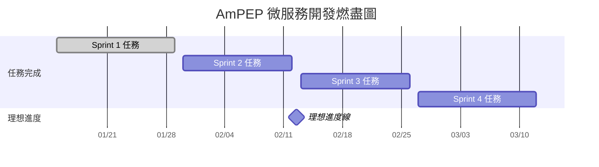

# AmPEP 微服務開發進度追蹤

## 📊 項目概覽儀表板

### 整體進度
- **項目開始日期**: 2024-01-15
- **預計完成日期**: 2024-03-12
- **當前進度**: 0% (0/20 任務完成)
- **剩餘時間**: 8週

### Sprint進度追蹤

| Sprint | 開始日期 | 結束日期 | 任務數 | 已完成 | 完成率 | 狀態 |
|--------|----------|----------|--------|--------|--------|------|
| Sprint 1 | 2024-01-15 | 2024-01-29 | 7 | 0 | 0% | 🟡 進行中（Docker build 成功，容器已啟動） |
| Sprint 2 | 2024-01-30 | 2024-02-12 | 5 | 0 | 0% | ⚪ 未開始 |
| Sprint 3 | 2024-02-13 | 2024-02-26 | 4 | 0 | 0% | ⚪ 未開始 |
| Sprint 4 | 2024-02-27 | 2024-03-12 | 4 | 0 | 0% | ⚪ 未開始 |

## 📈 燃盡圖 (Burndown Chart)

## 🎯 關鍵指標追蹤

### 技術指標

| 指標 | 目標值 | 當前值 | 狀態 | 最後更新 |
|------|--------|--------|------|----------|
| **代碼覆蓋率** | > 80% | 0% | 🔴 未開始 | 2024-01-15 |
| **API響應時間** | < 30秒 | N/A | ⚪ 未測試 | - |
| **測試通過率** | 100% | N/A | ⚪ 未開始 | - |
| **安全掃描** | 0漏洞 | N/A | ⚪ 未開始 | - |

### 項目指標

| 指標 | 目標值 | 當前值 | 狀態 | 趨勢 |
|------|--------|--------|------|------|
| **任務完成率** | 100% | 0% | 🔴 落後 | 📉 |
| **時間利用率** | > 80% | 0% | 🔴 未開始 | - |
| **缺陷密度** | < 5/千行 | 0 | 🟢 良好 | - |
| **技術債務** | < 10% | 0% | 🟢 良好 | - |

## 📋 每週進度報告

### 第1週 (2024-01-15 ~ 2024-01-21)

#### 完成任務
- [ ] 項目初始化 (TASK-001)
- [ ] R環境配置 (TASK-002)

#### 進行中任務
- [ ] 基礎API框架 (TASK-003)

#### 下週計劃
- [ ] 預測API實現 (TASK-004)
- [ ] 輸入驗證 (TASK-005)

#### 風險和問題
- **風險**: R環境配置可能遇到依賴包安裝問題
- **緩解**: 準備多個R鏡像備選方案

### 第2週 (2024-01-22 ~ 2024-01-28)

#### 完成任務
- [ ] 基礎API框架 (TASK-003)
- [ ] 預測API實現 (TASK-004)

#### 進行中任務
- [ ] 輸入驗證 (TASK-005)
- [ ] Docker容器化 (TASK-006)

#### 下週計劃
- [ ] 基礎測試 (TASK-007)
- [ ] Sprint 1 完成

## ⚠️ 風險追蹤

### 高風險項目

#### 風險-001: R語言性能限制
- **影響**: 高並發場景下性能瓶頸
- **概率**: 高
- **緩解策略**: 
  - [ ] 性能基準測試
  - [ ] 水平擴展準備
  - [ ] 技術棧遷移計劃
- **狀態**: 🔴 需要監控

#### 風險-002: 運維複雜度
- **影響**: 部署和維護困難
- **概率**: 中
- **緩解策略**:
  - [ ] 自動化部署工具
  - [ ] 運維文檔完善
  - [ ] 團隊培訓
- **狀態**: 🟡 需要關注

#### 風險-003: 時間延期
- **影響**: 項目交付延遲
- **概率**: 中
- **緩解策略**:
  - [ ] 敏捷開發方法
  - [ ] 優先級管理
  - [ ] 資源調整
- **狀態**: 🟡 需要關注

### 風險矩陣

| 風險等級 | 高影響 | 中影響 | 低影響 |
|----------|--------|--------|--------|
| **高概率** | 風險-001 | 風險-002 | - |
| **中概率** | - | 風險-003 | - |
| **低概率** | - | - | - |

## 🔄 每日站會記錄

### 2024-01-15 (項目啟動日)

#### 今日完成
- [x] 項目管理框架建立
- [x] 文檔結構創建
- [x] 任務分解完成

#### 明日計劃
- [ ] 開始TASK-001: 項目初始化
- [ ] 設置開發環境
- [ ] 創建Git分支

#### 阻塞問題
- 無

#### 需要幫助
- 確定團隊成員分工

## 📊 質量指標

### 代碼質量追蹤

| 指標 | Sprint 1 | Sprint 2 | Sprint 3 | Sprint 4 |
|------|----------|----------|----------|----------|
| **代碼覆蓋率** | 目標: 50% | 目標: 70% | 目標: 80% | 目標: 80% |
| **技術債務** | 目標: < 5% | 目標: < 5% | 目標: < 10% | 目標: < 10% |
| **代碼審查** | 100% | 100% | 100% | 100% |
| **靜態分析** | 0警告 | 0警告 | 0警告 | 0警告 |

### 性能指標追蹤

| 指標 | 目標值 | Sprint 1 | Sprint 2 | Sprint 3 | Sprint 4 |
|------|--------|----------|----------|----------|----------|
| **API響應時間** | < 30秒 | < 60秒 | < 45秒 | < 30秒 | < 30秒 |
| **並發處理** | 10 req/s | 1 req/s | 5 req/s | 10 req/s | 10 req/s |
| **內存使用** | < 2GB | < 4GB | < 3GB | < 2GB | < 2GB |
| **CPU使用率** | < 70% | < 90% | < 80% | < 70% | < 70% |

## 🎯 改進建議

### 短期改進 (本週)
1. **建立每日進度更新機制**
2. **設置自動化測試環境**
3. **創建代碼審查流程**

### 中期改進 (本月)
1. **實施持續集成**
2. **建立性能監控**
3. **完善文檔體系**

### 長期改進 (本季度)
1. **自動化部署流水線**
2. **完整的監控體系**
3. **運維自動化工具**

## 📞 溝通計劃

### 會議安排
- **每日站會**: 每天 9:00 AM (15分鐘)
- **週度回顧**: 每週五 2:00 PM (1小時)
- **Sprint規劃**: 每兩週一 10:00 AM (2小時)
- **技術討論**: 每週三 3:00 PM (1小時)

### 溝通渠道
- **即時溝通**: Slack/Teams
- **文檔共享**: GitHub Wiki
- **進度追蹤**: GitHub Projects
- **問題追蹤**: GitHub Issues

---

**最後更新**: 2024-01-15  
**版本**: 1.0.0 