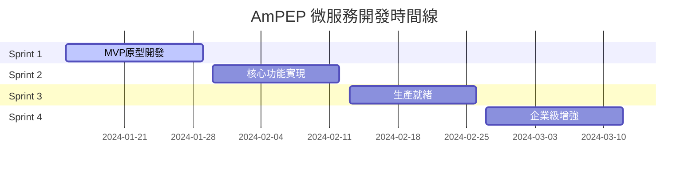

# AmPEP 微服務開發路線圖

## 🎯 項目願景

將AmPEP從單機R腳本轉換為企業級微服務，提供高可用、高性能的抗菌肽預測API服務。

## 📅 開發時間線

## 🚀 Sprint 1: MVP原型 (2週)

**目標**: 驗證技術可行性，建立基礎架構

### 核心交付物
- [ ] 基礎plumber API框架
- [ ] 單一預測端點實現
- [ ] Docker容器化
- [ ] 基本錯誤處理
- [ ] 健康檢查端點

### 技術重點
- R + plumber環境搭建
- 現有R代碼API化
- 基本輸入驗證
- 容器環境配置

### 成功標準
- ✅ API可以接收FASTA格式輸入
- ✅ 返回標準化JSON響應
- ✅ Docker容器可以正常啟動
- ✅ 基本錯誤處理機制

## 🔧 Sprint 2: 核心功能 (2週)

**目標**: 完善核心功能，提升代碼質量

### 核心交付物
- [ ] 完整的API端點集合
- [ ] 批量預測功能
- [ ] 完善的輸入驗證
- [ ] 單元測試覆蓋
- [ ] API文檔自動生成

### 技術重點
- 多算法支持 (AmPEP, Deep-AmPEP30, RF-AmPEP30)
- 性能優化
- 錯誤處理完善
- 測試策略實施

### 成功標準
- ✅ 所有API端點正常工作
- ✅ 測試覆蓋率 > 70%
- ✅ API響應時間 < 60秒
- ✅ 錯誤處理覆蓋所有場景

## 🛡️ Sprint 3: 生產就緒 (2週)

**目標**: 達到生產環境部署標準

### 核心交付物
- [ ] 監控和日誌系統
- [ ] 性能基準測試
- [ ] 安全加固
- [ ] CI/CD流水線
- [ ] 部署文檔

### 技術重點
- 監控指標收集
- 安全掃描和加固
- 自動化部署
- 性能調優

### 成功標準
- ✅ 監控覆蓋率 100%
- ✅ 安全掃描通過
- ✅ 自動化部署成功
- ✅ 性能基準達標

## 🏢 Sprint 4: 企業級增強 (2週)

**目標**: 滿足企業級性能和安全要求

### 核心交付物
- [ ] 高可用部署策略
- [ ] 分散式追蹤
- [ ] 企業級安全機制
- [ ] 運維自動化工具
- [ ] 知識轉移文檔

### 技術重點
- 負載均衡配置
- 認證授權機制
- 運維自動化
- 災難恢復

### 成功標準
- ✅ 可用性 > 99.5%
- ✅ 支持水平擴展
- ✅ 安全合規檢查通過
- ✅ 運維流程完善

## 📊 關鍵里程碑

| 里程碑 | 日期 | 交付物 | 狀態 |
|--------|------|--------|------|
| **MVP完成** | 2024-01-29 | 基礎API服務 | 🟡 進行中 |
| **核心功能完成** | 2024-02-12 | 完整API套件 | ⚪ 未開始 |
| **生產就緒** | 2024-02-26 | 可部署版本 | ⚪ 未開始 |
| **企業級發布** | 2024-03-12 | 生產版本 | ⚪ 未開始 |

## 🎯 成功指標

### 技術指標
- **API響應時間**: < 30秒 (95th percentile)
- **可用性**: > 99.5%
- **錯誤率**: < 1%
- **測試覆蓋率**: > 80%

### 業務指標
- **用戶滿意度**: > 4.5/5
- **功能完整性**: 100%需求覆蓋
- **文檔完整性**: 100%覆蓋
- **運維效率**: 部署時間 < 10分鐘

## 🔄 風險管理

### 高風險項目
1. **R語言性能限制**
   - 緩解策略: 性能監控 + 水平擴展
   - 備選方案: 技術棧遷移

2. **運維複雜度**
   - 緩解策略: 自動化工具 + 培訓
   - 備選方案: 外部專家支持

3. **時間延期**
   - 緩解策略: 敏捷開發 + 優先級管理
   - 備選方案: 資源增加

## 📈 持續改進

### 每週回顧會議
- 進度評估
- 問題識別
- 改進措施
- 風險更新

### 質量保證
- 代碼審查
- 測試自動化
- 性能監控
- 安全掃描

---

**最後更新**: 2024-01-15  
**版本**: 1.0.0 